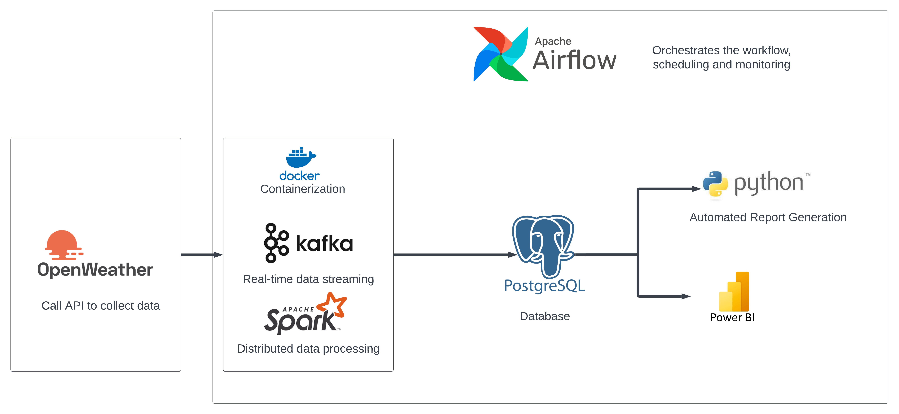

# Weather Data Pipeline -  Kafka, Spark, Airflow

## Project Overview
This project implements a robust weather data pipeline using Apache Kafka, Apache Spark, and Apache Airflow. It collects weather data from multiple Australian cities, processes it in real-time, stores it in a PostgreSQL database, and generates visualizations.

## Technologies Used

- **Apache Kafka**: For real-time data streaming, Kafka is used to collect weather data from an API and publish it to various topics for processing.
- **Apache Spark**: Spark processes the data consumed from Kafka in a distributed manner, transforming and aggregating the weather data.
- **Apache Airflow**: Airflow orchestrates the workflow, scheduling and monitoring each step of the data pipeline to ensure smooth operation.
- **PostgreSQL**: PostgreSQL is the database used to store the processed weather data, providing a reliable and scalable storage solution.
- **Python**: Python is used throughout the pipeline for data ingestion, processing, and automation tasks, leveraging libraries such as pandas, Matplotlib, and Seaborn.
- **Power BI**: Power BI is used to create interactive dashboards and reports from the data stored in PostgreSQL, providing insights and visualizations.
- **Docker & Docker Compose**: Docker and Docker Compose are used for containerization, making it easy to deploy and manage the different components of the pipeline.

## Setup and Installation

### Prerequisites
- Docker and Docker Compose installed on your system
- Git for version control

### Steps to Run
1. Clone the repository:
git clone https://github.com/yxc24/weather-data-pipeline.git
cd weather-data-pipeline

2. Build and start the services:
docker-compose up --build

3. Access Airflow web interface:
Open a browser and go to `http://localhost:8080`

4. Trigger the DAG in Airflow to start the data pipeline

## Component Details

### Weather Data Producer (`weather_data_producer.py`)
Fetches weather data from an API for Australian cities and publishes it to a Kafka topic.

### Weather Data Processor (`weather_data_processor.py`)
Consumes data from Kafka, processes it using Spark, and stores it in PostgreSQL.

### Weather Visualizations (`weather_visualizations.py`)
Generates visualizations based on the collected weather data.

### Airflow DAG (`weather_dag.py`)
Orchestrates the entire pipeline, scheduling and monitoring each step.

## Data Flow
1. Weather data is collected and sent to Kafka
2. Spark job processes the streaming data
3. Processed data is stored in PostgreSQL
4. Visualizations are generated from the stored data
5. Airflow manages the entire workflow

## Visualizations
The pipeline generates the following visualizations:
- Distribution of weather conditions (Pie Chart)
- Temperature over time for each city (Line Chart)
- Humidity vs Temperature by city (Scatter Plot)
- Wind Speed distribution by city (Box Plot)

## Future Improvements
- Implement real-time alerting for extreme weather conditions
- Add more cities and data sources
- Enhance visualizations with interactive dashboards

## Contributing
Contributions to this project are welcome. Please fork the repository and submit a pull request with your changes.

## License
Copyright (c) 2024, Ye Xiang Chen
All rights reserved.

Redistribution and use in source and binary forms, with or without
modification, are permitted provided that the following conditions are met:

* Redistributions of source code must retain the above copyright notice, this
  list of conditions and the following disclaimer.

* Redistributions in binary form must reproduce the above copyright notice,
  this list of conditions and the following disclaimer in the documentation
  and/or other materials provided with the distribution.

* Neither the name of the copyright holder nor the names of its
  contributors may be used to endorse or promote products derived from
  this software without specific prior written permission.

THIS SOFTWARE IS PROVIDED BY THE COPYRIGHT HOLDERS AND CONTRIBUTORS "AS IS"
AND ANY EXPRESS OR IMPLIED WARRANTIES, INCLUDING, BUT NOT LIMITED TO, THE
IMPLIED WARRANTIES OF MERCHANTABILITY AND FITNESS FOR A PARTICULAR PURPOSE ARE
DISCLAIMED. IN NO EVENT SHALL THE COPYRIGHT HOLDER OR CONTRIBUTORS BE LIABLE
FOR ANY DIRECT, INDIRECT, INCIDENTAL, SPECIAL, EXEMPLARY, OR CONSEQUENTIAL
DAMAGES (INCLUDING, BUT NOT LIMITED TO, PROCUREMENT OF SUBSTITUTE GOODS OR
SERVICES; LOSS OF USE, DATA, OR PROFITS; OR BUSINESS INTERRUPTION) HOWEVER
CAUSED AND ON ANY THEORY OF LIABILITY, WHETHER IN CONTRACT, STRICT LIABILITY,
OR TORT (INCLUDING NEGLIGENCE OR OTHERWISE) ARISING IN ANY WAY OUT OF THE USE
OF THIS SOFTWARE, EVEN IF ADVISED OF THE POSSIBILITY OF SUCH DAMAGE.

## Contact
Adrian Ye Xiang Chen - yexiangchen0311@gmail.com

Project Link: https://github.com/yxc24/weather-data-pipeline
